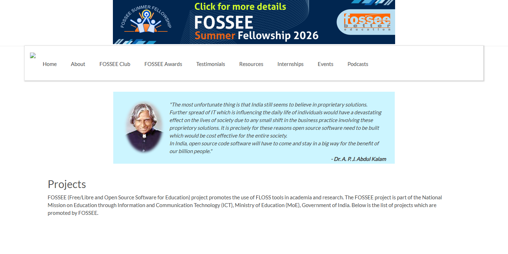
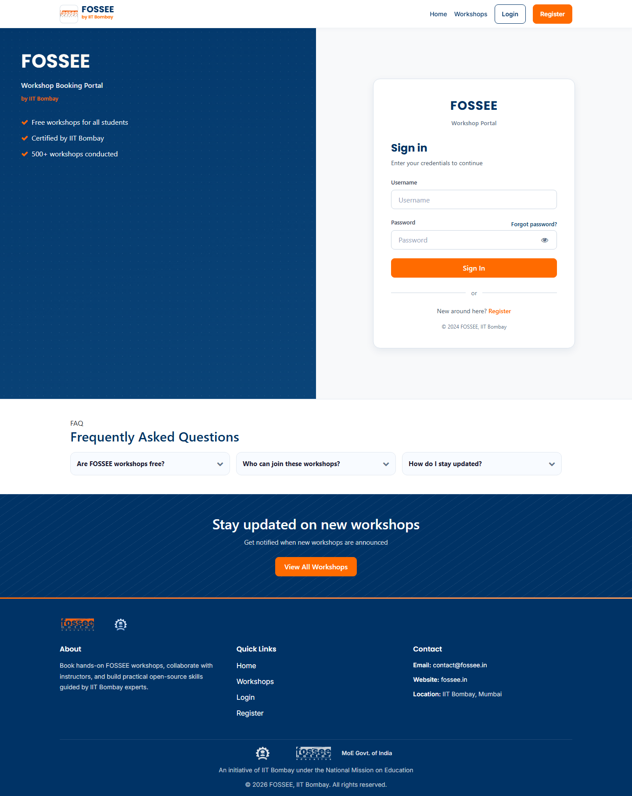
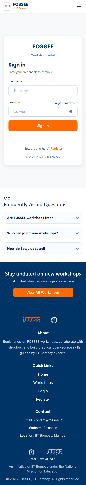
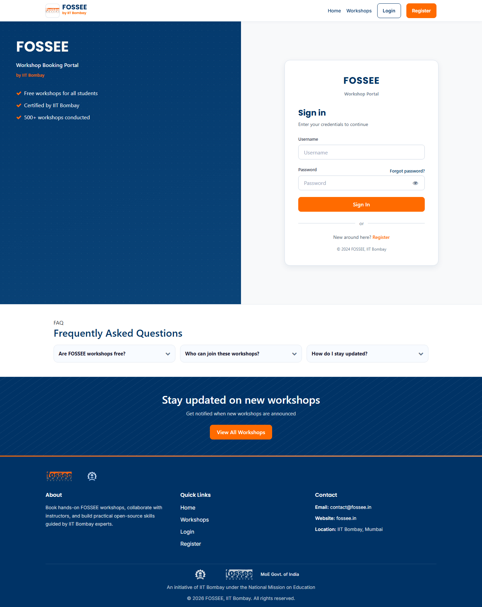
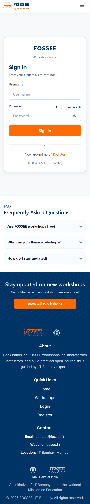
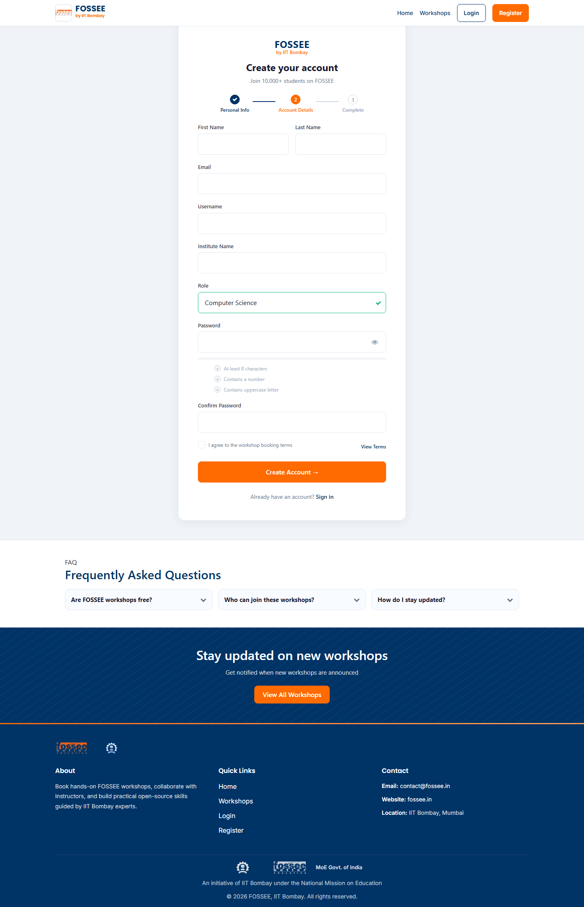
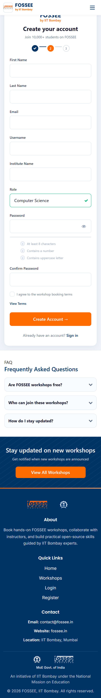
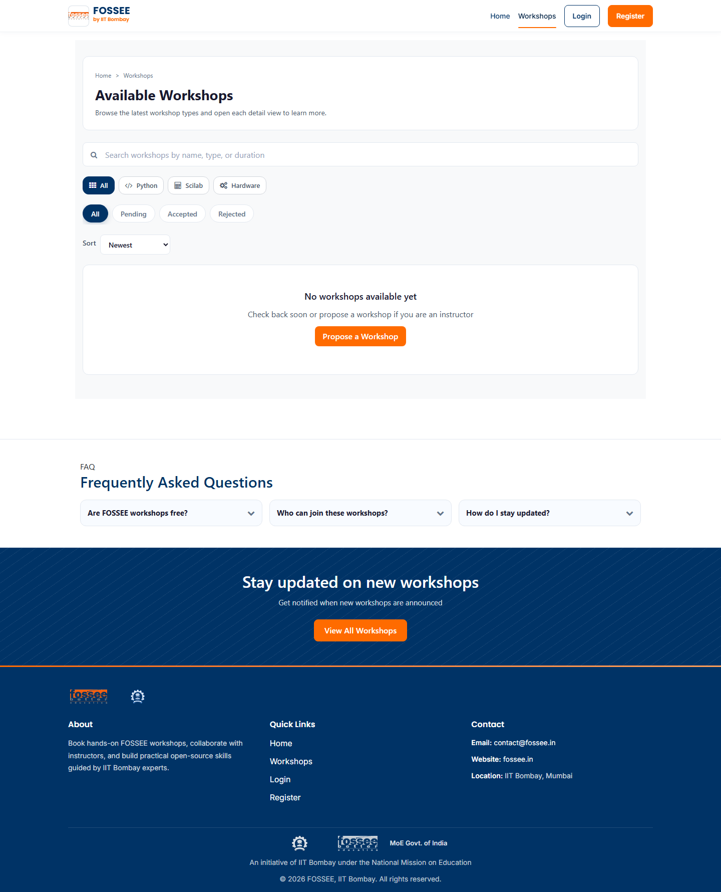
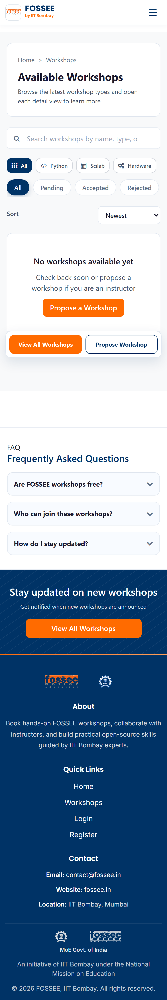

# FOSSEE Workshop Booking UI

React + Django redesign for the FOSSEE workshop booking portal. This submission modernizes the interface for mobile-first use, keeps the IIT Bombay visual identity, connects the workshop list to Django data, and documents the work clearly for screening review.

## 🚀 Live Demo

https://fossee-workshop-booking-d3qru89c3-shivani-i-is-projects.vercel.app

## Setup Instructions

### Django backend
Prerequisites: Python 3.8+, pip, and Git.

```bash
git clone https://github.com/shivani-i-i/fossee-workshop-booking-ui.git
cd fossee-workshop-booking-ui
python -m venv .venv
.venv\Scripts\Activate.ps1
pip install -r requirements.txt
python manage.py migrate
python manage.py runserver
```

The Django app runs at http://127.0.0.1:8000.

### React frontend
Open a second terminal in the same repo and run:

```bash
cd frontend
npm install
npm run dev
```

The React app runs at http://127.0.0.1:5173.

## 📸 Before & After

> **Before** — Original FOSSEE repo (github.com/FOSSEE/workshop_booking)
> **After** — My React redesign (live: https://fossee-workshop-booking-d3qru89c3-shivani-i-is-projects.vercel.app)

---

### 🏠 Home Page
| Before (Original FOSSEE) | After — Desktop | After — Mobile |
|--------------------------|-----------------|----------------|
|  |  |  |

**What changed:** Added full-width hero section, stats bar,
how-it-works steps, category grid and CTA band.
Original had no landing experience.

---

### 🔐 Login Page
| Before (Original FOSSEE) | After — Desktop | After — Mobile |
|--------------------------|-----------------|----------------|
|  |  |  |

**What changed:** Replaced plain centered form with
split-screen layout. Added IIT Bombay branding,
trust points, password show/hide toggle and
orange CTA button.

---

### 📝 Register Page
| Before (Original FOSSEE) | After — Desktop | After — Mobile |
|--------------------------|-----------------|----------------|
|  |  |  |

**What changed:** Replaced HTML table-based form with
modern CSS Grid layout. Added real-time password
strength meter, per-field validation, terms modal
and responsive two-column field layout.

---

### 📚 Workshop List
| Before (Original FOSSEE) | After — Desktop | After — Mobile |
|--------------------------|-----------------|----------------|
|  |  |  |

**What changed:** Added hero banner, live search,
category and status filter chips, sort dropdown,
workshop cards with colored gradient headers,
and graceful empty state. Original showed a
plain unstyled list.

## Design Principles

**Mobile-first layout**. The interface was redesigned from the smallest screens upward because students are most likely to open the portal on phones. Navigation, cards, forms, and workshop lists were tuned to stay readable and tappable on narrow viewports first, then expanded for desktop.

**Clear visual hierarchy**. The redesign uses stronger typographic contrast, card spacing, and action emphasis so the user can immediately scan for the important route, action, and state. The workshop list now reads as a structured product surface instead of a flat static page.

**IIT Bombay identity**. The palette follows the institution’s recognizable navy and orange language with #003366 and #FF6B00. That keeps the redesign visually tied to FOSSEE and makes the product feel official rather than generic.

**Design tokens through variables.css**. Shared colors, spacing, radii, shadows, and sizing live in CSS custom properties so the UI stays consistent across pages. This makes future changes predictable and reduces the chance of drifting styles.

**Honesty over fabrication**. The workshop page now uses a real Django endpoint and shows a truthful empty state when there is no data in the database. I avoided fake workshop records so the submission remains accurate, reviewable, and aligned with the actual backend state.

## Responsiveness

Responsiveness was handled with flexible layout primitives rather than separate page variants. Grid and flexbox were used to let cards, headers, and controls reflow naturally across widths. The workshop list collapses to a single column on smaller screens, while the same components remain usable on larger screens without layout rewrites.

The typography and spacing scale down smoothly so headings, body text, chips, and buttons remain readable on 375px devices. Controls are sized for touch, and the design keeps enough vertical spacing to avoid accidental taps. The React app was also validated at mobile and desktop widths so the result behaves consistently across common student devices.

## Performance Tradeoffs

1. I used plain React and CSS instead of adding animation or UI libraries, which keeps the bundle smaller and easier to maintain.
2. I used a lightweight Django JSON endpoint for workshop data rather than introducing a heavier API layer, which keeps integration simple.
3. I kept visual effects restrained so the interface looks modern without relying on expensive blur-heavy surfaces or large image assets.
4. I accepted a smaller amount of dynamic logic in exchange for clarity and speed, because the screening task values quick load time and maintainability over flashy motion.

## Challenges

**React to Django API connection via Vite proxy**. The React app needed to fetch data from Django during development without cross-origin issues. I solved that by adding a Vite proxy to forward `/workshop` requests to the backend and then wiring the workshops page to read the JSON response directly.

**Honest empty state instead of fake data**. The database currently has no workshop records, so the UI could not truthfully show populated workshop cards. I redesigned the page to support loading, error, filter, and empty states so the experience stays useful even when no content exists.

## Tech Stack

| Technology | Usage |
|------------|-------|
| Django | Backend application and data source |
| React | Frontend user interface |
| Vite | React development server and build tool |
| JavaScript | UI logic and data handling |
| CSS | Visual styling and responsive layout |

## Project Structure

```text
workshop_booking/
├── frontend/
│   ├── src/
│   │   ├── App.jsx
│   │   ├── main.jsx
│   │   └── styles.css
│   └── vite.config.js
├── workshop_app/
├── workshop_portal/
├── screenshots/
│   ├── before/
│   └── after/
└── README.md
```

## Design References

| Reference | Why it informed the redesign |
|----------|-------------------------------|
| NPTEL | Clean academic portal structure and information density |
| Coursera | Card-based browsing and category scanning patterns |
| Vercel | Crisp layout, strong hierarchy, and efficient spacing |
| Linear | Minimal surfaces, status treatment, and compact controls |
| IIT Bombay official | Brand colors and institutional visual identity |

## License

MIT License. See the repository `LICENSE` file for full terms.
