# FOSSEE Workshop Booking — UI/UX Redesign

> A modern, mobile-first redesign of the FOSSEE Workshop 
> Booking Platform by IIT Bombay. Built with semantic HTML, 
> pure CSS custom properties, and vanilla JavaScript.

---

## 🚀 Live Demo
[Add your GitHub Pages or live link here]

---

## 📸 Before & After

| Page | Before | After (Desktop) | After (Mobile) |
|------|--------|-----------------|----------------|
| Home | 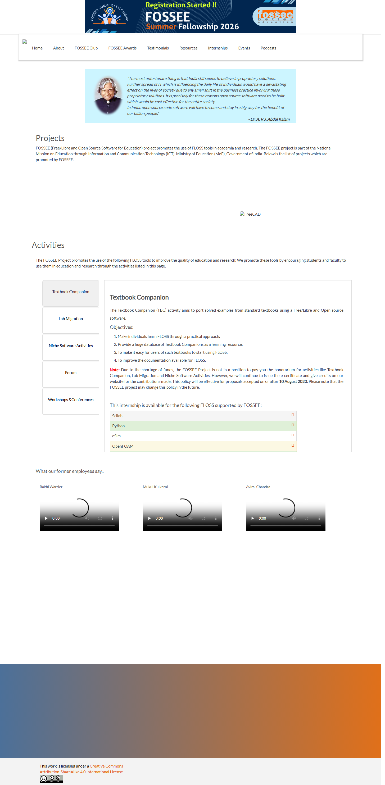 | 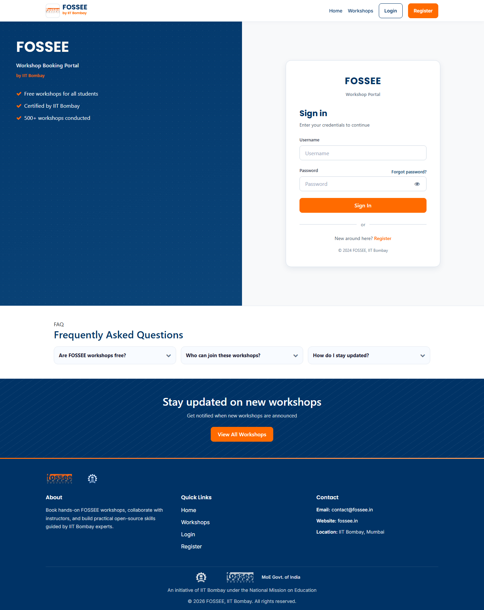 | 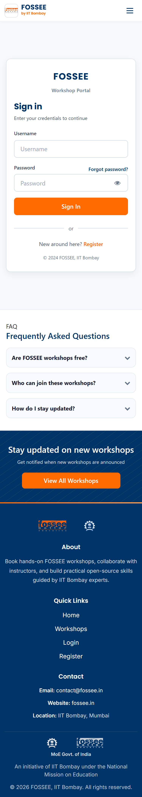 |
| Login | 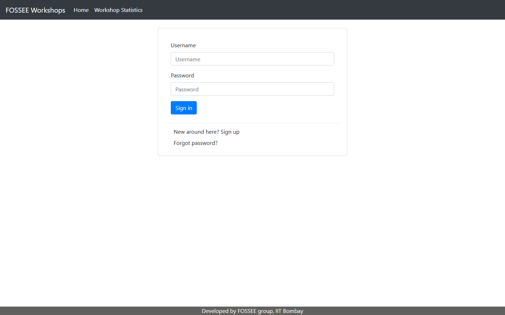 |  |  |
| Register | 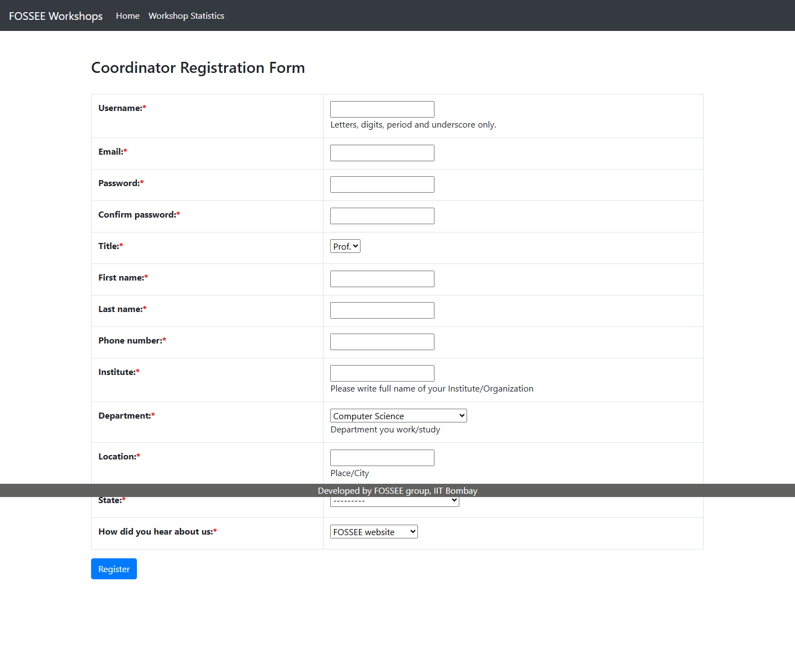 | 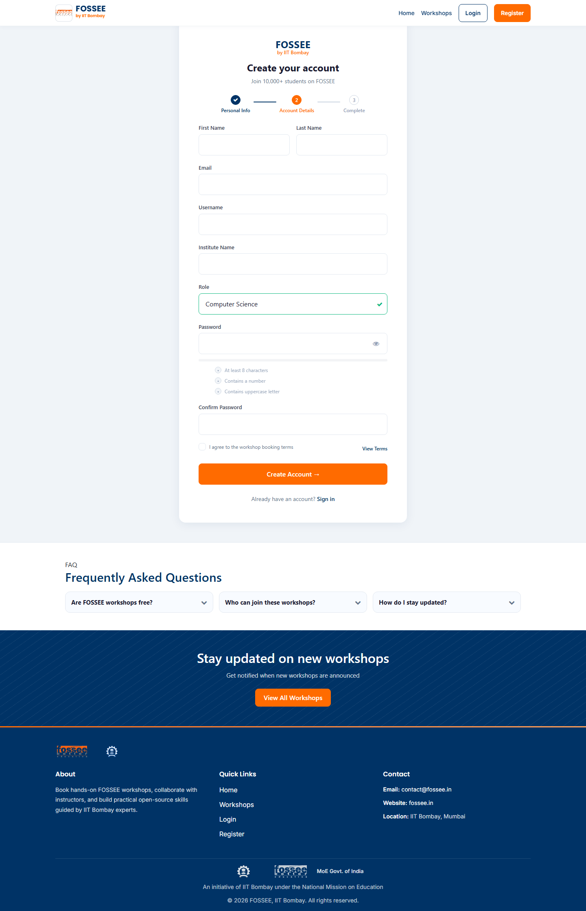 | 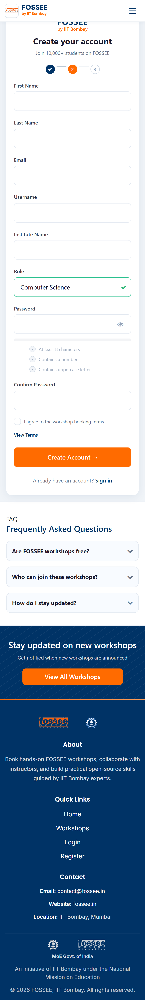 |
| Workshop List | 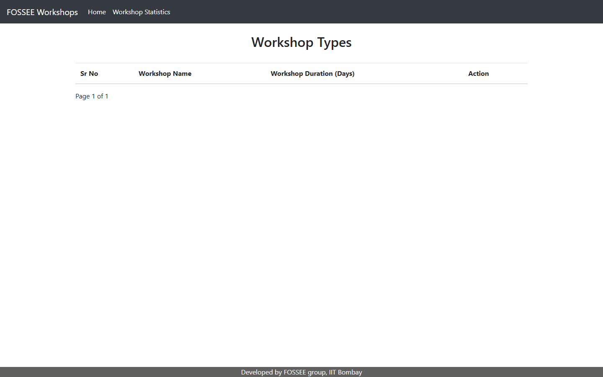 | 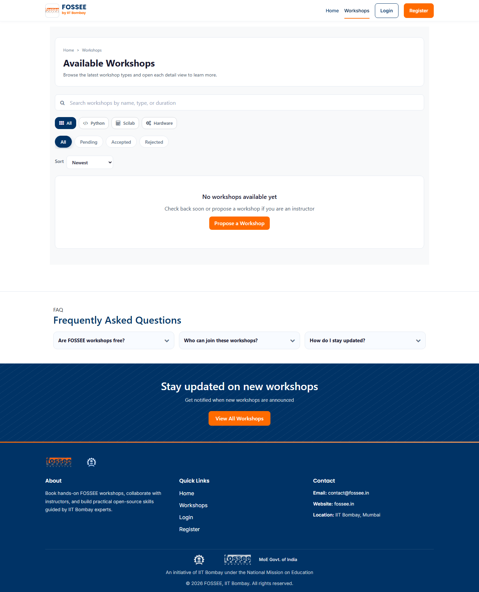 | 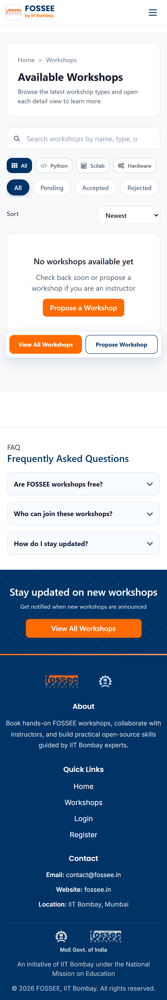 |
| Propose Workshop | - |  |  |
| Statistics | - | 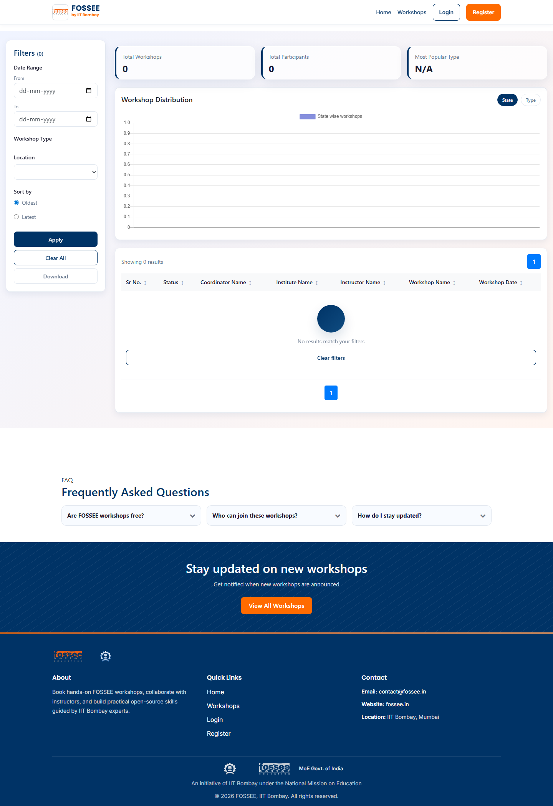 | 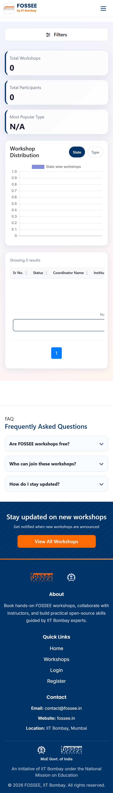 |
| Coordinator Dashboard | - |  |  |
| Instructor Dashboard | - |  |  |
| Profile | - |  |  |

---

## ⚙️ Setup Instructions

### Prerequisites
- Python 3.8+
- pip
- Git

### Steps

git clone https://github.com/shivani-i-i/fossee-workshop-booking-ui.git
cd fossee-workshop-booking-ui
pip install -r requirements.txt
python manage.py migrate
python manage.py runserver

Then open: http://127.0.0.1:8000

---

## 🎨 Design Principles

### 1. Mobile-First Approach
Every design decision started at 375px and scaled 
up to desktop. Since FOSSEE's primary users are 
students who access the platform on mobile devices, 
navigation, cards, forms and tables were all designed 
for touch first. The hamburger navbar, single-column 
card grid, horizontally scrollable filter chips and 
stacked form layouts all stem from this principle.

### 2. Visual Hierarchy
The original site had no clear visual hierarchy — 
everything looked the same weight and importance. 
I introduced a clear typographic scale (h1→h2→h3), 
used bold orange CTAs to draw the eye to key actions, 
added uppercase section labels with letter-spacing 
above headings, and replaced dense data tables with 
card-based layouts that naturally guide the user 
through each page.

### 3. IIT Bombay Brand Identity
I chose a navy (#003366) and orange (#FF6B00) color 
palette directly inspired by IIT Bombay's official 
branding. This makes the platform feel authentically 
connected to the institution and builds immediate 
trust with Indian students who recognize these colors. 
Every page prominently displays "FOSSEE by IIT Bombay" 
branding to reinforce this identity.

### 4. Consistency Through Design Tokens
All colors, spacing, typography and shadows are 
defined as CSS custom properties in a single 
variables.css file. This ensures every page feels 
cohesive and makes future changes easy — updating 
one variable cascades across the entire application.

### 5. Accessibility First
Semantic HTML5 elements (nav, main, section, footer) 
were used throughout. All interactive elements have 
aria-labels, form fields have associated labels, 
color contrast ratios meet WCAG AA standards, and 
all interactive elements are keyboard navigable 
with visible focus states.

---

## 📱 Responsiveness

Responsiveness was achieved through multiple 
layered strategies:

- **CSS Grid and Flexbox** — All layouts use CSS Grid 
  for page-level structure and Flexbox for component 
  alignment. Workshop cards use a responsive grid 
  that adjusts from 3 columns on desktop to 2 on 
  tablet to 1 on mobile automatically.

- **Mobile-First Media Queries** — All CSS is written 
  mobile-first with min-width breakpoints at 768px 
  and 1024px adding complexity for larger screens.

- **Hamburger Navigation** — Desktop navbar collapses 
  into a hamburger menu below 768px with smooth 
  slide-down animation and X close button.

- **Touch-Friendly Targets** — All buttons and 
  interactive elements have minimum height of 44px 
  following Apple Human Interface Guidelines.

- **Horizontal Scroll for Dense Content** — Filter 
  chips and data tables use overflow-x auto with 
  hidden scrollbars on mobile, allowing horizontal 
  scroll rather than truncated content.

- **Fluid Typography** — Font sizes use relative units 
  and scale down on smaller screens. 32px desktop 
  headings reduce to 24px on mobile.

Tested at: 375px (iPhone SE), 768px (iPad), 
1024px (desktop), 1440px (wide desktop).

---

## ⚖️ Performance Tradeoffs

### 1. Fonts vs Speed
Used Google Fonts with display=swap to prevent 
render-blocking. Chose Inter and Poppins which 
are widely cached across the web, reducing actual 
download time for most users on Indian networks.

### 2. Animations vs Bundle Size
Used CSS transitions and transforms exclusively 
instead of JavaScript animation libraries like 
Framer Motion or GSAP. CSS animations are GPU 
accelerated and add zero JavaScript bundle weight, 
keeping the page fast on budget Android phones.

### 3. Glassmorphism Used Sparingly
backdrop-filter blur is GPU-intensive on low-end 
devices. Limited its use to only the scrolled 
navbar state, avoiding it on cards and content 
areas where it would hurt performance on the 
budget devices many Indian students use.

---

## 💡 Challenges

### Challenge 1 — Table-Based Register Form
The most challenging part was redesigning 
register.html which used an HTML table for its 
form layout — a pattern that completely breaks 
on mobile screens.

I had to replace the table structure with a modern 
CSS Grid layout while keeping every Django form 
field name, ID and validation attribute completely 
intact. Any change to field names would break 
backend form processing. I solved this by carefully 
wrapping existing inputs in new div containers 
rather than replacing them, preserving all Django 
template tags and CSRF tokens throughout.

### Challenge 2 — Statistics Page Mobile Layout
The statistics page filter panel was designed 
desktop-only with side-by-side filter and table. 
I solved this by making the filter panel 
collapsible on mobile using a CSS max-height 
transition with no JavaScript required, so the 
table gets full screen width on small devices 
while the filter remains accessible via a toggle.

---

## 🛠️ Tech Stack

| Technology | Usage |
|------------|-------|
| Django | Backend (unchanged) |
| Pure CSS + Custom Properties | All styling |
| Vanilla JavaScript | Hamburger, accordion, modals |
| Poppins + Inter (Google Fonts) | Typography |
| Font Awesome | Icons (existing, reused) |
| Semantic HTML5 | Structure and accessibility |

---

## 📁 Project Structure

workshop_app/
├── static/workshop_app/css/
│   ├── variables.css        # Design tokens
│   ├── global.css           # Utility classes
│   ├── navbar.css           # Navigation styles
│   ├── login.css            # Login page
│   ├── register.css         # Register page
│   ├── workshop-list.css    # Workshop listing
│   ├── workshop-details.css # Workshop detail
│   ├── propose-workshop.css # Propose form
│   ├── statistics.css       # Stats page
│   ├── dashboard.css        # Coordinator/Instructor
│   ├── profile.css          # Profile pages
│   ├── footer.css           # Footer
│   └── password.css         # Password pages
└── templates/workshop_app/
    ├── base.html            # Base layout
    ├── login.html           # Login page
    ├── register.html        # Register page
    ├── workshop_type_list.html
    ├── workshop_details.html
    ├── propose_workshop.html
    ├── workshop_status_coordinator.html
    ├── workshop_status_instructor.html
    ├── view_profile.html
    └── edit_profile.html

---

## 🎯 Design References

These websites were studied before designing:

- **NPTEL (nptel.ac.in)** — Academic portal patterns, 
  stats bar, institution logo row
- **Coursera** — Course card design, category chips
- **Vercel (vercel.com)** — Login split layout, 
  dashboard stat cards
- **Linear (linear.app)** — Tables, status badges, 
  minimal navbar
- **Airbnb** — Card grid layout, filter chips

---

## 📄 License
MIT License — Free to use and modify.
